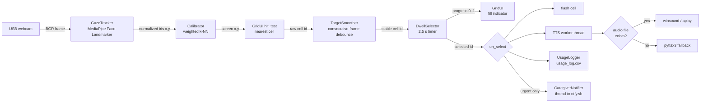

# نظرة — Nazrah: Full Project Documentation

> **Nazrah** (نظرة, "a glance / a look") is an Arabic-first, eye-gaze communication
> board (an AAC device) for non-verbal or paralyzed patients. The patient looks at a
> phrase on a screen, holds their gaze, and the device speaks it aloud in a real
> Saudi voice — and, for urgent needs, pushes an alert to the caregiver's phone.
> It is built for how care actually happens in Saudi/Gulf homes: multigenerational,
> home-based, organized around prayer and family roles.

This is the complete reference for the project — what it is, how it works, how to
build/run/deploy it, why each design decision was made, what went wrong along the
way, and how to evaluate it. For a shorter overview see the [README](../README.md);
for the step-by-step Raspberry Pi install see [raspberry_pi_setup.md](raspberry_pi_setup.md).

**Contents**

1. [Project overview](#1-project-overview)
2. [System architecture](#2-system-architecture)
3. [Hardware](#3-hardware)
4. [Software modules](#4-software-modules)
5. [The interaction pipeline, step by step](#5-the-interaction-pipeline-step-by-step)
6. [Calibration in depth](#6-calibration-in-depth)
7. [Phrase set and cultural design](#7-phrase-set-and-cultural-design)
8. [Audio](#8-audio)
9. [User interface and rendering](#9-user-interface-and-rendering)
10. [Caregiver alerts](#10-caregiver-alerts)
11. [Configuration reference](#11-configuration-reference)
12. [Installing and running](#12-installing-and-running)
13. [Testing](#13-testing)
14. [Troubleshooting](#14-troubleshooting)
15. [Design decision and iteration log](#15-design-decision-and-iteration-log)
16. [Evaluation](#16-evaluation)
17. [Known limitations and future work](#17-known-limitations-and-future-work)
18. [Repository layout](#18-repository-layout)
19. [Development timeline](#19-development-timeline)

---

## 1. Project overview

### 1.1 The problem

Commercial eye-tracking AAC (Augmentative and Alternative Communication) tools — for
example Tobii Dynavox — are built in English for Western care settings and cost
thousands of dollars. Families in Saudi Arabia caring for a non-verbal relative
(stroke, ALS, cerebral palsy, advanced age) often have neither the budget nor a tool
whose vocabulary reflects how they actually speak and care for each other at home.

### 1.2 The solution

A low-cost device built from a Raspberry Pi, an ordinary USB webcam and a screen. No
dedicated eye-tracking hardware is used: the camera image is analysed in software to
estimate where the patient is looking.

The patient experience:

1. The screen shows a grid of 12 large cells, each with an icon and an Arabic word.
2. The patient looks at the cell they want. The cell gradually fills with a lighter
   green while the gaze is held (the *dwell* indicator).
3. After 2.5 seconds of steady gaze the cell flashes white, the phrase is spoken aloud
   from a pre-recorded voice, and the selection is logged.
4. For urgent phrases (pain, help) a push notification is also sent to the caregiver's
   phone, in case they are not in the room.

### 1.3 What makes it culturally specific

It is deliberately *not* a generic yes/no/hungry board translated into Arabic. See
[section 7](#7-phrase-set-and-cultural-design). In short: prayer-related needs, family
terms as actually spoken (يمّه, يبى), and everyday needs phrased in Saudi/Gulf
colloquial rather than textbook Modern Standard Arabic — and voiced by a real Saudi
speaker rather than a synthetic voice.

### 1.4 Current status (as of 2026-09-17)

| Capability | Status |
|---|---|
| Camera capture + MediaPipe gaze tracking | Working on Windows and on the Pi |
| 12-point grid calibration, saved between launches | Working (12/12 samples on both the CrowPi screen and a 4K TV) |
| Dwell selection with smoothing (weighted k-NN + debounce) | Working; correct selections across all phrases in live testing |
| Arabic text + colour emoji rendering on the Pi | Working (via Pillow, see [9.3](#93-why-text-and-icons-are-drawn-with-pillow-on-the-pi)) |
| Pre-recorded audio for all 12 phrases | Working, audible through an external speaker |
| Caregiver push alerts (ntfy.sh) | Working; uses a smoke-test topic that must be replaced before real use |
| Double-click launcher (no SSH/keyboard needed) | Working |
| Relay-controlled light | Hardware verified; deliberately no longer called by the app |
| Formal user research (interviews, sources) | **Template only — still to be done** ([research.md](research.md)) |
| Formal accuracy evaluation with real users | **Not yet done** — see [section 16](#16-evaluation) |

---

## 2. System architecture

### 2.1 Overview



The whole loop runs in one main thread (`nazrah/main.py: main()`), once per camera
frame. Only slow or blocking work is pushed off that thread: speech playback (one
persistent worker fed by a queue) and network alerts (a short-lived thread per alert).

### 2.2 Design principles

These recur throughout the code and explain many decisions in [section 15](#15-design-decision-and-iteration-log):

- **Robustness over precision.** A webcam gaze signal is weak and noisy. Every stage
  is designed so noise cannot cause a wrong or runaway result, even at the cost of
  fine positioning.
- **Hardware behind interfaces.** Camera and light each have a real implementation and
  a stand-in, so the same code runs on a laptop and on the Pi.
- **Degrade gracefully.** Missing recording → TTS fallback → printed text. No
  internet → alert skipped, speech still works. No GPIO hardware → no-op light.
- **Never block the gaze loop.** A frozen loop reads to the patient as a frozen device.
- **Single source of truth.** The calibration grid size is *derived* from the phrase
  list and column count, not kept in sync by hand (a real bug the project hit).

---

## 3. Hardware

### 3.1 What the project actually runs on

| Component | Details |
|---|---|
| Computer | **Raspberry Pi 4 Model B Rev 1.5** (verify with `cat /proc/device-tree/model`) |
| Case/kit | Elecrow **CrowPi** educational kit: built-in 1920×1080 screen and sensor modules, including a relay on GPIO21 (pin 40) |
| Camera | USB UVC webcam (the CrowPi's built-in one, or an external "USB 2.0 Camera"), used via OpenCV at a requested 1280×720 |
| Screen | The CrowPi's own 1920×1080 screen, **or** an HDMI TV (tested on a 4096×2160 LG TV) |
| Audio out | External speaker plugged into the Pi's 3.5 mm jack (ALSA card 2, "bcm2835 Headphones") |
| Power | **Official Raspberry Pi 4 USB-C supply, 5 V / 3 A** (see the warning below) |
| Dev machine | Windows 11 laptop with a webcam and speakers |

> **The board is a Pi 4, not a Pi 5.** Early notes in the project called it a Pi 5;
> this was wrong and was corrected on 2026-09-14. It matters for performance
> (roughly 5–10 fps here, vs ~25 fps on the Windows laptop) and for power (below).

### 3.2 Power supply — an important lesson

For several days the external camera showed intermittent magenta/purple speckle noise
that made face detection fail (0–3 of 12 calibration points captured). It was
extensively — and wrongly — attributed to room lighting. The real cause was the **power
supply**: a Pi 4 wants a plain 5 V / 3 A supply and does **not** do full USB-C Power
Delivery negotiation, so phone fast-chargers (which negotiate 9 V/12 V) and laptop
USB-C ports are poor sources. After switching to the official supply the image became
clean and calibration reliably reached 12/12. Note `vcgencmd get_throttled` read `0x0`
(no undervoltage) even with the bad supplies, so a clean reading does not prove the
supply is adequate.

### 3.3 The light relay (not used by the app)

`nazrah/light.py` can switch a relay on GPIO21. The CrowPi manual specifies this
relay as **low-voltage, breadboard use only — never wire it to 110/220 V mains.**
Switching a real room light needs a proper mains-rated smart plug. An earlier version
of the app had a home screen with a "turn off light" button; it was removed because the
extra screen got in the way of reaching the phrases (see the [decision log](#15-design-decision-and-iteration-log)).
The module and wiring are intact if it is ever wanted again.

### 3.4 Physical setup tips that measurably affect accuracy

- Sit roughly an arm's length from the camera, facing it, centred in frame. Sitting too
  far back compresses the vertical signal (see [6.4](#64-signal-range-and-why-distance-matters)).
- Keep the head roughly where it was during calibration; recalibrate if you move.
- Avoid a bright light source directly in the camera's view.

---

## 4. Software modules

All application code is in the `nazrah/` package (~1,300 lines).

| Module | Responsibility |
|---|---|
| `main.py` | Orchestrator: builds every component, runs calibration, then the per-frame loop |
| `gaze_tracker.py` | Camera frame → normalized iris position using MediaPipe |
| `calibration.py` | Calibration data, weighted k-NN mapping, save/load |
| `smoothing.py` | `TargetSmoother`: consecutive-frame debounce of the target cell |
| `dwell.py` | `DwellSelector`: fires a selection after sustained gaze; exposes progress |
| `ui.py` | Tkinter fullscreen grid (`GridUI`), hit-testing, dwell fill, calibration dot |
| `phrases.py` | The phrase data (`Phrase` dataclass, `PHRASES` list) |
| `tts.py` | `TTSEngine`: audio bank → pyttsx3 → print fallback chain |
| `notifier.py` | `CaregiverNotifier`: ntfy.sh push alerts |
| `logger.py` | `UsageLogger`: CSV log of every selection |
| `camera.py` | `CameraSource` interface; `WebcamSource` (OpenCV) and `PiCameraSource` (CSI) |
| `light.py` | `LightController` interface; GPIO relay and no-op implementations |
| `config.py` | Every tunable constant and environment-variable override |

### 4.1 `gaze_tracker.py`

`GazeTracker` wraps MediaPipe's **Face Landmarker** task (the Tasks API — the older
`mp.solutions` API was abandoned after a protobuf conflict on Windows). Per frame it
returns the average of the two iris-centre landmarks (indices 468 and 473 of the 478
output landmarks) as a normalized `(x, y)` in image space, or `None` if no face was
found. The ~4 MB model is downloaded once to `nazrah/models/` (git-ignored) and then
works fully offline.

**It deliberately does not isolate pure eyeball rotation.** Most people turn their head
toward what they look at, so head movement is part of the real signal; calibration
learns whatever combination of head and eye motion each user produces.

### 4.2 `calibration.py`

`Calibrator` stores `(eye_pos, screen_pos)` pairs and maps a live `eye_pos` to a
screen position with **inverse-distance-weighted k-nearest-neighbours**
(`nearest_target(eye_pos, k=3)`). Also provides `median_point()` (robust per-axis
median used to collapse the many frames sampled at one calibration point) and
`save_calibration()` / `load_calibration()`. Full detail in [section 6](#6-calibration-in-depth).

### 4.3 `smoothing.py` — `TargetSmoother`

Debounces the per-frame target: a new target replaces the current one only after being
seen `confirm_frames` (default 2) **consecutive** frames. A single stray frame cannot
flip the target, because reverting resets the count. `reset()` clears state and must be
called whenever the valid target set changes.

Majority-vote over a sliding window was tried first and rejected: right after a real
gaze shift the window is still full of the previous target, so it felt laggy.

### 4.4 `dwell.py` — `DwellSelector`

`update(target_id)` is called once per frame. It returns the target id when the same
target has been held continuously for `dwell_seconds` (2.5 s), then resets (the target
must be re-acquired to select again). `None` or a different target resets the timer.
`progress` (0–1) drives the on-screen fill. Dwell was chosen over blink detection
because it is more reliable for users with limited or unpredictable eyelid control. The
clock is injectable, which is how the state machine is unit-tested without sleeping.

### 4.5 `ui.py` — `GridUI`

A fullscreen Tkinter window of `tk.Frame` cells (icon + text). Key methods:
`show(items, columns)`, `set_active_cell(id, progress)`, `flash_selection(id)`,
`hit_test(x, y)` (nearest cell *centre*, never "no match" — see [9.2](#92-hit-testing)),
and `show_calibration_target(x, y)` (a small red topmost dot). Escape exits. See
[section 9](#9-user-interface-and-rendering).

### 4.6 `tts.py` — `TTSEngine`

`speak(phrase)` tries, in order: (1) `audio/<phrase.id>.wav` via `winsound` (Windows) or
`aplay` (Linux); (2) `pyttsx3` with a *fresh engine per call*; (3) print the text.
Called only from the single TTS worker thread. See [section 8](#8-audio).

### 4.7 `notifier.py`, `logger.py`, `camera.py`, `light.py`

- **`CaregiverNotifier.notify(phrase)`** — HTTP POST to `https://ntfy.sh/<topic>` with
  the Arabic text and transliteration; returns `True/False`, never raises.
- **`UsageLogger`** — appends `timestamp, phrase_id, phrase_text_ar` to `usage_log.csv`;
  `most_used(top_n)` summarizes it.
- **`camera.py`** — `WebcamSource(index, width=1280, height=720)` for any OpenCV camera;
  `PiCameraSource` for the CSI ribbon camera (needs `picamera2`; unused so far).
- **`light.py`** — `GpioLightController(pin)` (gpiozero) raises `RuntimeError` if it cannot
  claim the pin so callers can fall back to `NoOpLightController`.

### 4.8 `main.py` — orchestration

`main()` constructs the camera, tracker, logger, TTS engine, dwell selector, smoother and
(optionally) notifier; starts the TTS worker thread; builds the `GridUI` from
`GRID_ITEMS` (one cell per phrase); loads or runs calibration; then loops until the
window closes. The loop prints a status line every 15 frames
(`fps=… eye_pos=… screen=… raw=… smoothed=… progress=…`) and flags any step slower than
0.5 s as `[SLOW]` — these lines are the main diagnostic when debugging remotely.

---

## 5. The interaction pipeline, step by step

For every camera frame, in `main.py`:

1. **Capture** — `camera.read()` returns a BGR frame (or `None`).
2. **Gaze estimate** — `tracker.get_eye_position(frame)` → `(x, y)` or `None`.
3. **Map to screen** — if a face was found and calibration has samples,
   `calibrator.nearest_target(eye_pos, k=TARGET_K_NEIGHBORS)` → blended screen `(x, y)`.
4. **Find the cell** — `ui.hit_test(x, y)` → the cell whose centre is nearest.
5. **Debounce** — `smoother.update(cell_id)` → the stable target.
6. **Dwell** — `dwell.update(target)` → a cell id if the dwell completed; `dwell.progress`
   feeds `ui.set_active_cell()` to fill the cell.
7. **On selection** (`on_select`):
   - `ui.flash_selection(id)` (white flash, 400 ms);
   - `speak_phrase(id)`: enqueue for the TTS worker, append to the usage log, and — if
     `phrase.urgent` and a topic is configured — start a background alert thread.
8. **Redraw** — `ui.update()`.

Typical latency to a selection is the 2.5 s dwell plus ~2 frames of debounce.

---

## 6. Calibration in depth

### 6.1 The procedure

On first launch (or whenever a saved calibration is unusable) the app shows a small red dot at
each of **12 points** in turn — a 4×3 grid matching the phrase grid. The patient looks at the
dot and holds still (the console prints "Look at the red dot and hold still…"; the screen shows
only the dot). For each point the app waits 1.2 s for the gaze to arrive, then samples frames
for 2.0 s and stores the **per-axis median** of the iris positions against that point's screen
coordinates. A point with no detected face is skipped, so a poor session can end with fewer
than 12 samples — check the count printed as "Calibration done with N samples".

Point positions are `_steps(n) = 0.05 + i·0.9/(n−1)`: columns at 5 %, 35 %, 65 %, 95 %
of screen width; rows at 5 %, 50 %, 95 % of height — 5 % margins keep points on-screen.

### 6.2 Mapping a live reading to the screen

`Calibrator.nearest_target(eye_pos, k)`:

1. Find the `k` calibration samples whose stored eye position is closest (Euclidean).
2. If the query exactly equals one sample, return that sample's screen position.
3. Otherwise return the average of those samples' screen positions weighted by
   `1 / distance²`.

The result is always inside the convex hull of the calibrated points: it **interpolates
but never extrapolates**. `hit_test` then snaps it to the nearest phrase cell.

### 6.3 How the approach evolved (and why)

| Version | Approach | Why it was replaced |
|---|---|---|
| 1 | Least-squares regression to continuous screen coordinates | The gaze signal is weak/noisy relative to the screen range; small drift was amplified into wildly out-of-bounds predictions |
| 2 | 1-nearest-neighbour (snap to one calibration point) | Robust, but jittery right at the boundary between two points' territory; a reading drifting across it flips the result on almost no change |
| 3 (current) | Weighted k-NN, k = 3 | Smooth near boundaries, still cannot extrapolate |

Averaging calibration samples with a **median** rather than a mean was also a deliberate
fix: one frame with a momentary landmark misdetection barely moves a median.

### 6.4 Signal range and why distance matters

The raw gaze signal spans only a small range — typically **0.02–0.1** in normalized image
coordinates across the whole screen. Frame-to-frame tracking noise is a meaningful
fraction of that. Consequences:

- **Too many grid points** and adjacent points end up closer together than the noise, so
  they can no longer be told apart. This is the practical ceiling on phrases per screen;
  going beyond 12 should be *measured* rather than assumed to work.
- **Sitting too far from the camera** shrinks the apparent iris movement. On 2026-09-14 a
  calibration taken too far back had a vertical spread of only ~0.02 across all three rows,
  so nearly every live reading resolved to the bottom row regardless of where the user
  looked. Recalibrating in a good position produced a well-spread range (~0.26–0.45).

If selection suddenly feels wrong, check the `median_eye_pos` values printed during
calibration: a very narrow spread on either axis means the setup (distance, framing, image
quality) is the problem, not the algorithm.

### 6.5 Persistence

A successful calibration is saved to `calibration_data.json` (git-ignored — it is specific to
one camera position and one screen). On the next launch it is loaded and calibration is
skipped. It records the screen resolution and is rejected if the resolution changed (so
moving the Pi from the CrowPi screen to a TV automatically triggers a fresh calibration).
To force recalibration: set `NAZRAH_RECALIBRATE=1` or delete the file. Recalibrate whenever
the camera, screen, seating position or user changes.

---

## 7. Phrase set and cultural design

### 7.1 The 12 phrases

The grid is shown row by row, left to right (the row layout is `GRID_COLUMNS = 4`).

| # | id | Arabic | Transliteration | Meaning | Category | Urgent | Icon | Audio file |
|---|---|---|---|---|---|---|---|---|
| 1 | `water` | مويه | moyah | water | basic needs | | 💧 | `water.wav` |
| 2 | `hungry` | جوعان | jaw'an | hungry | basic needs | | 🍽 | `hungry.wav` |
| 3 | `bathroom` | حمام | hammam | bathroom | basic needs | | 🚻 | `bathroom.wav` |
| 4 | `pain` | وجع | waja' | pain | basic needs | **yes** | ⚠ | `pain.wav` |
| 5 | `prayer` | الصلاة | as-salah | prayer | prayer | | 🕌 | `prayer.wav` |
| 6 | `wudu` | وضوء | wudu' | ablution | prayer | | 💦 | `wudu.wav` |
| 7 | `mother` | يمّه | yumma | mother | family | | 👩 | `mother.wav` |
| 8 | `father` | يبى | yaba | father | family | | 👨 | `father.wav` |
| 9 | `yes` | إي | ee | yes | responses | | ✅ | `yes.wav` |
| 10 | `no` | لا | la | no | responses | | ❌ | `no.wav` |
| 11 | `help` | لحقوني | la7gooni | "hurry, help me!" | responses | **yes** | 🆘 | `help.wav` |
| 12 | `sleep` | ودّي أنام | widdi anam | I want to sleep | responses | | 🛌 | `sleep.wav` |

### 7.2 Why these words

- **Colloquial, not textbook.** Several phrases were switched from formal Modern Standard
  Arabic to Saudi/Gulf colloquial and confirmed with the user: ماء→مويه (water),
  ألم→وجع (pain), نعم→إي (yes), ساعدني→لحقوني (help — an authentic urgent call),
  أريد أن أنام→ودّي أنام (sleep). Words already natural (جوعان, حمام, لا) and the two
  prayer terms (classical regardless of dialect) were left alone.
- **Family terms as spoken:** يمّه (mother) and يبى (father) are colloquial Gulf terms of
  address, replacing an earlier generic "baba".
- **Prayer is first-class:** الصلاة and وضوء sit alongside basic needs, reflecting how
  prayer structures the day.
- **Urgent = two phrases.** Only `pain` and `help` trigger caregiver alerts, guarded by a
  unit test that fewer than half of all phrases may be urgent so routine selections do not
  spam the caregiver's phone.

### 7.3 Editing the phrase list

Edit `PHRASES` in `nazrah/phrases.py` (`id`, `category`, `text_ar`, `transliteration`,
`icon`, optional `urgent=True`). Rules:

- **Keep the count a multiple of `GRID_COLUMNS` (4).** The calibration grid is derived from
  `len(PHRASES)`; a non-multiple leaves an incomplete last row (enforced by a test).
- Record a matching `audio/<id>.wav` ([section 8](#8-audio)); until then TTS is the fallback.
- Re-run calibration — the grid changed.
- `docs/research.md` is where the *justification* for phrase choices belongs (Criterion A/B).

---

## 8. Audio

### 8.1 Why pre-recorded audio

A real Saudi speaker sounds far more natural than any TTS voice for dialect-specific words,
and it removes the need for an installed Arabic voice. That last point turned out to be
decisive: **Windows ships no Arabic SAPI5 voice** (only US English), so `pyttsx3` given
Arabic text silently produces *no audio at all* rather than erroring (confirmed by playing
plain English through the same pipeline, which worked). On the Pi, espeak-ng's Arabic voice
is a robotic approximation at best.

### 8.2 Playback chain

`TTSEngine.speak(phrase)`:

1. `audio/<phrase.id>.wav` exists → play it (`winsound.PlaySound` on Windows,
   `aplay '<file>'` elsewhere). The directory is `config.AUDIO_BANK_DIR`.
2. Otherwise → `pyttsx3`, a **fresh engine every call**.
3. Otherwise → print the phrase text.

Playback is invoked only from one **single persistent worker thread** fed by a
`queue.Queue`. Two earlier designs failed on Windows: calling TTS on the gaze thread froze
the whole app (pyttsx3 hung in `runAndWait()`), and one-thread-per-call collided in
pyttsx3's shared run-loop ("run loop already started"). One worker guarantees one call in
flight; extra selections queue.

### 8.3 Recording the bank

See [`audio/README.md`](../audio/README.md). Files must be `.wav`, named exactly
`<phrase.id>.wav`. Any subset works; missing files fall back to TTS. Trim leading/trailing
silence. All 12 are currently recorded (each ≈1.4–2.0 s, 48 kHz).

### 8.4 Raspberry Pi audio gotchas

Two settings on the Pi were found to **reset between sessions/reboots**, each time
looking like a new bug:

- **ALSA default device.** With no `~/.asoundrc`, plain `aplay` (what `tts.py` calls) fails
  with `aplay: main:850: audio open error: Unknown error 524` even though
  `aplay -D plughw:2,0 file.wav` works — the default isn't pointed at card 2
  (`bcm2835 Headphones`).
- **Volume.** The `PCM` control on card 2 resets low.

`run_nazrah.sh` therefore rewrites both **on every launch**:

```bash
cat > ~/.asoundrc << 'EOF'
pcm.!default { type plug; slave.pcm "hw:2,0" }
ctl.!default { type hw; card 2 }
EOF
amixer -c 2 sset PCM 100% unmute
```

Also required on Linux: `espeak-ng` (not classic `espeak`) for `pyttsx3` to initialise, and
`aplay` (package `alsa-utils`). HDMI audio (cards 0/1) only works when the connected display
provides an audio sink.

---

## 9. User interface and rendering

### 9.1 Layout and colours

Fullscreen Tk window; 12 cells in a 4×3 grid that stretch to fill the screen, each an icon
above an Arabic word. Sizes are for a patient who may view from a bed at a distance:
icon 180 px, text 40 px (both were raised after being reported too small on the real screen).

The palette is green and white — the Saudi flag's colours: green cells (`#2e7d32`) with
white border, icon and text. As gaze dwells, the cell background brightens toward a light
green (`#8be08f`); on selection it flashes white for 400 ms. Only the cell's own background
changes, so the icon and text stay constantly legible.

### 9.2 Hit-testing

`hit_test()` returns the cell whose **centre** is nearest the screen position — never
"no cell". Exact bounding-box containment was replaced because the small gaps between cells
(and an incomplete last row) created dead zones a calibrated point could land in and get no
match. Gaze should always resolve to *something*.

### 9.3 Why text and icons are drawn with Pillow on the Pi

The Pi runs the app on a `uv`-installed **Python 3.11** (needed for MediaPipe — see
[12.3](#123-raspberry-pi-summary)). That interpreter's bundled **Tcl/Tk 9.0 has no
Xft/fontconfig/TrueType support**: `tkinter.font.families()` returns only 28 legacy
PostScript fonts, none with Arabic or colour-emoji glyphs. So *no font installed on the
system can ever reach Tk*. Symptom on the real device: the grid showed blank space where the
Arabic words (and later the icons) should be.

Fix: when `GRID_FONT_FILE` / `GRID_EMOJI_FONT_FILE` are set (defaults on Linux), the words and
icons are **rendered to bitmaps with Pillow** (which links its own FreeType and raqm) and shown
in `Label(image=…)`, which Tk can always display. On Windows these are unset and normal Tk text
is used.

Gotchas worth knowing if you touch this code:

- **Right-to-left**: pass `direction="rtl"` to Pillow's `text()`/`textbbox()` and give it the
  *original* string. raqm does both letter shaping and bidi reordering. Pre-processing with
  `arabic_reshaper` + `python-bidi` on top double-processes and renders the word backwards.
- **Colour emoji**: use `embedded_color=True`. Noto Color Emoji is a bitmap font with a
  **single 109 px strike**; requesting any other size raises `OSError: invalid pixel size` and
  crashes the app. The code loads at 109 px and resizes the bitmap.
- Load the font **once**, not per cell (re-parsing it cost ~380 ms per cell, freezing screen
  changes for seconds).
- Keep a reference to each `PhotoImage` or Tk silently drops it.

### 9.4 Display server notes (Pi)

The Pi's desktop is **Wayland (labwc)**; Tk runs through XWayland. Consequences: `scrot`
screenshots come back solid black and `xrandr --mode` fails (`BadMatch`). Use `wlr-randr` to
change resolution, e.g.
`WAYLAND_DISPLAY=wayland-0 XDG_RUNTIME_DIR=/run/user/1000 wlr-randr --output HDMI-A-1 --mode 1920x1080@60`.
To inspect what the camera sees remotely, capture a frame with OpenCV instead (see [14](#14-troubleshooting)).

---

## 10. Caregiver alerts

When an **urgent** phrase (`pain`, `help`) is selected and a topic is configured,
`CaregiverNotifier` POSTs to `https://ntfy.sh/<topic>` in a background thread with the body
`<arabic text> (<transliteration>)` and headers `Title: Nazrah: urgent need`,
`Priority: urgent`, `Tags: warning`. Failure (no network, ntfy down) returns `False` and
prints a message — it never raises and never blocks gaze tracking or local speech.

**Setup:** pick a long random topic; the caregiver installs the free
[ntfy app](https://ntfy.sh/) (or opens `https://ntfy.sh/<topic>` in a browser) and subscribes;
set `NAZRAH_NTFY_TOPIC` (already exported in `run_nazrah.sh`). Unset → alerts are skipped and a
note is printed at startup.

> **Security.** The topic name *is* the access control: anyone who knows it can read every
> alert. `run_nazrah.sh` currently contains a **development smoke-test topic** — replace it
> with a long random string before real use, and do not use guessable names.

The device cannot detect whether anyone is in the room (the camera watches the patient), so
alerts fire on urgent selections rather than sensing presence. The Pi needs internet (its
own WiFi) for this; on flaky WiFi an alert can fail transiently with `Temporary failure in
name resolution`.

---

## 11. Configuration reference

All settings live in `nazrah/config.py`. Environment-variable overrides:

| Setting | Env var | Default | Purpose |
|---|---|---|---|
| `DWELL_SECONDS` | – | `2.5` | Gaze-hold time to select (raised from 1.5 after accidental selections) |
| `TARGET_CONFIRM_FRAMES` | – | `2` | Consecutive frames before a target change counts |
| `TARGET_K_NEIGHBORS` | – | `3` | Calibration points blended per reading (1 = plain nearest-neighbour) |
| `GRID_COLUMNS` | – | `4` | Grid columns; `len(PHRASES)` must be a multiple |
| `CAMERA_INDEX` | `NAZRAH_CAMERA_INDEX` | `0` | OpenCV camera index / `/dev/videoN` |
| `CALIBRATION_FILE` | `NAZRAH_CALIBRATION_FILE` | `calibration_data.json` | Where calibration is saved |
| `FORCE_RECALIBRATE` | `NAZRAH_RECALIBRATE` (`1`) | off | Ignore the saved calibration |
| `NTFY_TOPIC` | `NAZRAH_NTFY_TOPIC` | unset | Enables caregiver alerts |
| `AUDIO_BANK_DIR` | `NAZRAH_AUDIO_BANK_DIR` | `audio` | Folder of `<id>.wav` recordings |
| `GRID_FONT_FAMILY` | `NAZRAH_GRID_FONT` | `Segoe UI` (Win) / `Noto Sans Arabic` | Tk font when not using Pillow rendering |
| `GRID_FONT_FILE` | `NAZRAH_GRID_FONT_FILE` | none (Win) / Noto Sans Arabic `.ttf` | Enables Pillow rendering of phrase text |
| `GRID_EMOJI_FONT_FILE` | `NAZRAH_GRID_EMOJI_FONT_FILE` | none (Win) / Noto Color Emoji `.ttf` | Enables Pillow rendering of icons |
| `LIGHT_GPIO_PIN` | – | `21` | Relay GPIO pin (unused by the app) |
| `CALIBRATION_POINTS_RATIO` | – | derived | 4×3 grid of screen ratios, from `PHRASES` and `GRID_COLUMNS` |

UI constants in `ui.py`: `ICON_FONT_SIZE = 180`, `TEXT_FONT_SIZE = 40`, and the colour constants.

**Camera index is never fixed.** It shifts on reboots and USB re-plugs (seen: `/dev/video2` on
one day, `/dev/video0` on the next). Always confirm with `v4l2-ctl --list-devices` before use.

---

## 12. Installing and running

### 12.1 Development machine (Windows)

```bash
python -m venv .venv
.venv\Scripts\activate
pip install -r requirements-dev.txt      # runtime deps + pytest
python -m nazrah.main
```

First run downloads the face model (~4 MB) and needs internet once. Python 3.10 with
`mediapipe 1.0.1`, `opencv 5`, `Pillow` was used for development. The window is fullscreen;
**Escape** quits. Set `NAZRAH_NTFY_TOPIC` to test alerts.

### 12.2 Dependencies

`requirements.txt`: `opencv-python>=4.10`, `mediapipe>=1.0.1`, `pyttsx3>=2.90`, `numpy>=1.26`,
`Pillow>=10.0`. Dev adds `pytest>=8.0`. Pi-only extras (not in `requirements.txt`): `gpiozero`
+ `lgpio` for the relay (unused by the app), system packages `espeak-ng`, `alsa-utils`,
`fonts-noto-core`, `fonts-noto-color-emoji`.

### 12.3 Raspberry Pi summary

The full walkthrough is [raspberry_pi_setup.md](raspberry_pi_setup.md). The essentials:

- **Python 3.11 in a `.venv311`, with `mediapipe==0.10.14`.** The only MediaPipe wheels for the
  system Python 3.13 (1.0.0/1.0.1) crash with `SIGILL … go/sigill-fail-fast` on this CPU
  (they need an AES instruction the Pi lacks). `uv python install 3.11` provides a prebuilt
  interpreter with no compilation. (Building CPython 3.11 from source failed under GCC 14.)
- **Fonts:** `fonts-noto-core` and `fonts-noto-color-emoji` (see [9.3](#93-why-text-and-icons-are-drawn-with-pillow-on-the-pi)).
  If `apt` fails with a package-index parse error, download the `.deb` directly from
  `deb.debian.org/debian/pool/main/…` and `dpkg -i` it.
- **Deploy by `git pull`** (push from the dev machine, pull on the Pi). After `chmod +x`, git
  sees a file-mode change; run `git checkout -- run_nazrah.sh` before pulling, then `chmod +x` again.
- **Flaky WiFi:** SSH commands often drop silently (exit −1, nothing reached the Pi) — verify
  an action landed (check the process/file) instead of trusting a missing error. Large packages
  are more reliable downloaded on the dev machine and SFTP-transferred than pip-installed on the Pi.
- **Network changes:** the Pi gets a new DHCP address on every network. Confirm its current IP
  (`hostname -I`) rather than trusting an old one.

### 12.4 The launcher (no keyboard or SSH)

`run_nazrah.sh` (repo root) sets everything the device needs and starts the app:
`cd` to the repo, activate `.venv311`, rewrite `~/.asoundrc`, set volume to 100 %, export
`DISPLAY=:0`, `NAZRAH_CAMERA_INDEX`, `NAZRAH_NTFY_TOPIC`, then `python3 -m nazrah.main`.
`Nazrah.desktop` is a desktop entry that runs it. Install:

```bash
chmod +x run_nazrah.sh
mkdir -p ~/Desktop && cp Nazrah.desktop ~/Desktop/ && chmod +x ~/Desktop/Nazrah.desktop
```

The first time, right-click the icon and choose **Allow Launching** (a one-time trust step the
desktop requires). `.gitattributes` forces LF endings on `.sh`/`.desktop` files because CRLF
breaks a shell shebang line. **The camera index inside the script is hard-coded — re-check it
with `v4l2-ctl --list-devices` if the app cannot open the camera.**

### 12.5 Running remotely over SSH (development)

```bash
pkill -9 -f 'python3 -m nazrah.main'          # always kill first, or the camera stays locked
rm -f /tmp/nazrah_run.log ~/nazrah/calibration_data.json   # optional: force recalibration
(~/nazrah/run_nazrah.sh > /tmp/nazrah_run.log 2>&1 &)
tail -f /tmp/nazrah_run.log
```

---

## 13. Testing

### 13.1 Automated tests

```bash
pytest          # 37 tests, ~0.3 s, no camera or display needed
```

| File | Tests | Covers |
|---|---|---|
| `test_calibration.py` | 11 | weighted k-NN (exact match, distance weighting, no wild extrapolation), median outlier rejection, save/load round-trip, missing file, resolution-mismatch rejection |
| `test_smoothing.py` | 8 | first frame, consecutive confirmation, single-frame noise rejected, interrupted streak resets, `None` handling, `reset()` |
| `test_phrases.py` | 8 | unique ids, Arabic text present, all categories represented, lookups, urgent flags, not-mostly-urgent guard |
| `test_dwell.py` | 4 | fires after threshold, looking away/switching resets, progress fraction |
| `test_notifier.py` | 3 | posts to the topic URL with Arabic text and urgent priority, failure returns `False` without raising, base-URL handling |
| `test_config.py` | 2 | calibration grid size equals phrase count; points inside screen bounds |
| `test_light.py` | 1 | no-op controller |

### 13.2 What is *not* automated

The gaze tracker, camera, UI, audio and GPIO need real hardware and are tested by hand.
Suggested manual checklist for a release:

- [ ] `python -m nazrah.main` opens fullscreen; Escape closes it cleanly.
- [ ] Calibration reaches 12/12 points; the printed `median_eye_pos` spreads are not tiny.
- [ ] Each of the 12 cells can be selected; the fill indicator and white flash behave.
- [ ] Each phrase plays its own recording, audibly, with no `aplay … 524` error.
- [ ] `pain` and `help` deliver a notification to a subscribed phone; the other 10 do not.
- [ ] Restart skips calibration; changing resolution or `NAZRAH_RECALIBRATE=1` forces it.
- [ ] Unplugging the network doesn't stall the app when selecting an urgent phrase.
- [ ] `usage_log.csv` gains one row per selection.
- [ ] Double-click launcher works from a cold boot.

---

## 14. Troubleshooting

| Symptom | Likely cause | Fix |
|---|---|---|
| `Could not open camera at index N` | Wrong index, or a previous instance still holds the camera | `pkill -9 -f 'python3 -m nazrah.main'`; check `v4l2-ctl --list-devices`; set `NAZRAH_CAMERA_INDEX` |
| `Calibration done with 0–3 samples` | Face not detected: out of frame, looking away, too dark, or noisy image | Capture a frame (below) and check framing, lighting, noise; sit centred and closer |
| Speckled magenta noise across the camera image (Pi only) | Inadequate power supply for a Pi 4 | Use the official 5 V/3 A supply (not a phone/laptop USB-C charger) |
| Selection sticks to one row / phrase | Compressed signal range from a stale or too-distant calibration | Recalibrate close to the camera; inspect `median_eye_pos` spreads |
| Selection feels jittery near cell borders | k-NN too low or debounce too low | Raise `TARGET_K_NEIGHBORS` / `TARGET_CONFIRM_FRAMES` a little |
| Accidental selections | Dwell too short | Raise `DWELL_SECONDS` |
| Grid shows icons but blank text (Pi) | Tk 9.0 has no TrueType support | Ensure `GRID_FONT_FILE` points to an installed Arabic `.ttf`; install `fonts-noto-core` |
| Grid shows text but no icons (Pi) | Same, for emoji | Install `fonts-noto-color-emoji`; ensure `GRID_EMOJI_FONT_FILE` exists |
| Arabic word appears **backwards** | Double bidi processing | Pass `direction="rtl"` with the original text; do not use `arabic_reshaper`/`python-bidi` |
| App crashes: `OSError: invalid pixel size` | Colour emoji font loaded at a non-native size | Load at 109 px, resize the bitmap (already the default) |
| No sound, log shows `aplay … Unknown error 524` | `~/.asoundrc` missing | Launch via `run_nazrah.sh` (rewrites it), or recreate it ([8.4](#84-raspberry-pi-audio-gotchas)) |
| Sound very quiet | PCM volume reset | `amixer -c 2 sset PCM 100% unmute` (also done by the launcher) |
| Windows: no sound for Arabic via TTS | No Arabic SAPI5 voice installed | Use the recorded audio bank |
| No caregiver notification | Topic not set, or Pi has no internet/DNS | Check the startup message; confirm the Pi resolves `ntfy.sh` |
| `git pull` on Pi: "local changes would be overwritten" | File-mode change from `chmod +x` | `git checkout -- run_nazrah.sh`, pull, `chmod +x` again |
| `apt` fails to parse the package index | Broken upstream package entry | Download the `.deb` directly and `dpkg -i` |
| `scrot` shows a black screen; `xrandr` errors (Pi) | Wayland/XWayland | Use `wlr-randr`; view the camera via OpenCV instead |
| Pi unreachable over SSH | New network / new DHCP address | Confirm IP with `hostname -I`; both machines must share a network |

**Capturing a diagnostic frame from the camera** — the single most useful remote debugging tool:

```python
import cv2
cap = cv2.VideoCapture(0)                       # use the confirmed index
cap.set(cv2.CAP_PROP_FRAME_WIDTH, 1280); cap.set(cv2.CAP_PROP_FRAME_HEIGHT, 720)
ok, frame = cap.read()
cv2.imwrite('/tmp/snapshot.jpg', frame)        # then copy it off the Pi and look at it
```

**Reading the console.** Each 15 frames the app prints
`fps=… eye_pos=(x, y)|None screen=(x, y) raw=<cell> smoothed=<cell> progress=<0..1>`.
`eye_pos=None` means no face. `raw` vs `smoothed` shows the debounce at work. `[SLOW] …`
flags any camera/inference/UI step over 0.5 s.

---

## 15. Design decision and iteration log

The project was built iteratively against real hardware. Each row is a problem that was
found, what was tried, and what it settled on — material for Criterion B (developing ideas)
and D (evaluating).

| # | Problem | Tried / cause | Decision |
|---|---|---|---|
| 1 | Legacy MediaPipe API failed on Windows (protobuf conflict) | `mp.solutions` face mesh | Use the **Tasks API** Face Landmarker with a downloaded `.task` model |
| 2 | Regression gaze→screen mapping gave out-of-bounds jumps | Least-squares regression | **Nearest-neighbour** classification, later **weighted k-NN** |
| 3 | Selections landed between cells | Calibration grid didn't match the phrase grid | Derive the calibration grid from `len(PHRASES)` and `GRID_COLUMNS`; enforce with a test |
| 4 | Window didn't fill the screen → coordinate mismatch | Windowed Tk | Fullscreen; cells stretch with grid weights |
| 5 | Gaze landing in gaps/incomplete rows matched nothing | Exact bounding-box hit test | **Nearest cell centre** always resolves |
| 6 | Target flickered on single noisy frames; majority-vote felt laggy | Majority vote over a window | **Consecutive-frame debounce** (2 frames) |
| 7 | Crash after switching screens | Smoother remembered an id no longer present | `TargetSmoother.reset()` on layout change |
| 8 | Calibration point skewed by outlier frames | Mean of samples | **Median** of samples |
| 9 | Accidental selections | 1.5 s dwell | **2.5 s** dwell |
| 10 | App froze after a selection | `pyttsx3.runAndWait()` hung on the gaze thread | Move TTS off-thread; then a **single worker + queue** after a per-call thread caused run-loop collisions |
| 11 | Fallback print crashed on Arabic (cp1252 console) | `print()` of Arabic | Catch `UnicodeEncodeError`, print the ASCII id |
| 12 | Caregivers may be out of earshot | Local speaker only | **ntfy.sh** push alerts for urgent phrases, off-thread, non-fatal |
| 13 | Recalibrating on every launch is unreasonable for a patient | Always calibrate | **Persist** calibration; invalidate on resolution change |
| 14 | `CAMERA_INDEX` config was never actually used | Hard-coded index 0 | Wire it through; env-overridable |
| 15 | Relay didn't fire on the CrowPi | Guessed GPIO pin 17 | Read the manual: **GPIO21**; add the low-voltage safety note |
| 16 | mediapipe crashes on the Pi (`SIGILL`) | Python 3.13 wheels need AES | **Python 3.11 via uv + mediapipe 0.10.14** |
| 17 | Blank Arabic text on the Pi | Tk 9.0 lacks TrueType | **Pillow-rendered bitmaps** |
| 18 | Arabic rendered backwards after that | Manual reshape + bidi on top of raqm | Let raqm do it (`direction="rtl"`) |
| 19 | Blank icons on the Pi | Same Tk limitation for emoji | Render with Noto Color Emoji via Pillow |
| 20 | Crash: `invalid pixel size` | Bitmap emoji font has one size | Load at 109 px and resize |
| 21 | Multi-second freeze on screen change | Re-parsing the font per cell | Load the font once |
| 22 | Text/icons too small on the real screen | Dev-monitor sizing | Icon 180 px, text 40 px |
| 23 | TTS silent for Arabic on Windows | No Arabic SAPI5 voice | **Pre-recorded audio bank**, TTS as fallback |
| 24 | Formal MSA sounded stiff | Textbook phrasing | **Saudi colloquial** phrases, user-verified |
| 25 | Home screen got in the way | Two-screen flow (light toggle + phrases) | **Single 12-phrase screen**; relay code kept but unused |
| 26 | Jittery selection at cell borders | 1-NN snapping | **Weighted k-NN** (k = 3) |
| 27 | Calibration 0–3/12 on the TV; noisy camera | Blamed lighting, cable, port, resolution | Root cause: **Pi 4 power supply** → official 5 V/3 A |
| 28 | Selection stuck on one row | Too far from the camera: compressed y range | Recalibrate close; inspect `median_eye_pos` spreads |
| 29 | Audio silent/quiet again each session | ALSA default and volume reset | **Self-heal both on every launch** |
| 30 | Needed SSH/keyboard to start the app | Manual launch | **Double-click launcher** |

---

## 16. Evaluation

> This section is where Criterion D lives. The tooling exists; **the formal evaluation with
> real users still has to be done and written up.** Below is what data exists, what it does and
> does not show, and a protocol to complete it.

### 16.1 Data available

`usage_log.csv` (git-ignored, generated at runtime) has **360 selections** from
2026-08-22 to 2026-09-06, made by the developer while testing — **not** by a patient or a
representative user, and recorded against earlier phrase wording (e.g. it includes ids that no
longer exist: `grandfather`, `quran`, `caregiver`).

| phrase_id | selections |
|---|---|
| water | 67 |
| hungry | 65 |
| pain | 56 |
| help | 35 |
| sleep | 27 |
| yes | 24 |
| no | 22 |
| bathroom | 22 |
| wudu | 10 |
| grandfather* | 9 |
| prayer | 9 |
| quran* | 5 |
| mother | 5 |
| father | 3 |
| caregiver* | 1 |

\* removed from the current phrase set.

**Read this honestly:** the most-selected phrases (water, hungry, pain) are the first row of the
grid — where the developer's testing concentrated — so these counts reflect test behaviour and
possible top-row bias, not what a patient needs most. They demonstrate the logging pipeline
works, not the vocabulary's usefulness.

### 16.2 Qualitative observations from live testing

- On the CrowPi screen and (after the power fix) on a 4K TV, calibration reached **12/12** points
  with 16–17 frames per point, and gaze correctly selected many different phrases with the
  dwell indicator completing.
- Before the fixes, calibration captured only 0–3/12 points on the TV over many attempts — a
  documented failure with a documented cause ([3.2](#32-power-supply--an-important-lesson)).
- Accuracy depends strongly on setup quality (distance, framing, image quality), as described
  in [6.4](#64-signal-range-and-why-distance-matters).
- Throughput is ~5–10 fps on the Pi 4 versus ~25 fps on the Windows laptop, so responsiveness on
  the Pi is limited by hardware, not a bug.

### 16.3 Suggested evaluation protocol

1. **Selection accuracy.** With a fresh calibration, ask a participant to select each of the 12
   phrases in a randomized order, N times each (e.g. N = 5). Record hit / wrong-cell / timeout.
   Report accuracy **per cell and per row** — the layout means position-dependent error is likely.
2. **False positives ("Midas touch").** Have the participant look around the screen without
   intending a selection for a fixed time; count unintended selections. Compare dwell values
   (e.g. 1.5 s / 2.0 s / 2.5 s / 3.0 s).
3. **Time to select.** Log time from prompt to selection.
4. **Calibration robustness.** Record calibration sample counts and `median_eye_pos` spreads;
   test after moving 10–20 cm and after a head turn to quantify drift.
5. **Fatigue/usability.** Short questionnaire (comfort, tiredness, ease, would-use) from
   participants — ideally including a caregiver.
6. **Cultural validity.** Ask native Saudi speakers whether each phrase and each recording is
   natural, and what is missing; feed results back into `research.md`.
7. **Caregiver alert reliability.** Count urgent selections vs. notifications received, and the
   latency.

To make step 1–3 easy to automate, extend `UsageLogger` with the *prompted* target, the
selected cell, the dwell duration and the calibration sample statistics — currently only the
selected phrase and timestamp are logged.

### 16.4 Traceability to the MYP criteria

| Criterion | Where |
|---|---|
| A — Inquiry & analysis | [research.md](research.md) *(template — needs real interviews and sources)*; [section 1](#1-project-overview); [7.2](#72-why-these-words) |
| B — Developing ideas | [section 6](#6-calibration-in-depth), [section 15](#15-design-decision-and-iteration-log), code comments explaining rejected alternatives |
| C — Creating the solution | This repository; [sections 2–12](#2-system-architecture) |
| D — Evaluating | [section 16](#16-evaluation), `usage_log.csv`, the manual checklist in [13.2](#132-what-is-not-automated) |

---

## 17. Known limitations and future work

### Limitations

- **Accuracy is setup-sensitive.** Needs a good camera position, decent distance and clean image;
  recalibration whenever the camera, screen, seat or user changes.
- **Limited target count.** The signal range bounds how many cells can be told apart; 12 is near
  the tested comfortable limit, and each page of phrases is a single screen (no navigation).
- **Head movement is part of the signal.** Unlike a dedicated eye tracker this is not pure eye
  tracking; a patient who cannot move their head at all will get a narrower range.
- **Single user, single calibration** at a time; no per-user profiles.
- **Frame rate** on a Pi 4 is ~5–10 fps.
- **Dwell selection** can trigger unintended selections when the user rests their gaze on a cell.
- **Caregiver alerts depend on the Pi's internet**, which has proven flaky, and use a public
  service with topic-name-as-password security.
- **No blink or other alternative input.**
- **The phrase set is small** and not yet validated by formal research or by real patients.
- The **relay/light control** is unwired from the UI.
- **Development-machine specifics:** Windows has no Arabic TTS voice; the Pi audio settings reset
  between sessions (worked around by the launcher).

### Future work

- Complete the user research and evaluation (sections [16](#16-evaluation) and `research.md`).
- Richer logging (prompted vs selected, dwell time, calibration stats) to automate evaluation.
- Multiple pages / categories so the vocabulary can grow without growing the grid (with a
  navigation cell), and a way to edit phrases without touching code.
- Adaptive calibration that refines its mapping from confirmed selections during use.
- An IR camera/illumination for dim rooms; a camera mount fixed relative to the screen.
- A real private alert channel (own ntfy server or another service) and an offline fallback.
- Re-adding household control (light, TV) as optional cells using a properly mains-rated relay.
- A custom 3D-printed enclosure integrating Pi, camera, screen and speaker.
- Per-user calibration profiles; quicker (fewer-point) recalibration.
- Real icon artwork in place of emoji; text-to-speech in a recorded regional voice for arbitrary
  phrases.

---

## 18. Repository layout

```
Nazrah Project/
├── README.md                  short overview
├── run_nazrah.sh              device launcher (audio self-heal + env + start)
├── Nazrah.desktop             double-click desktop entry for the launcher
├── requirements.txt           runtime dependencies
├── requirements-dev.txt       + pytest
├── .gitattributes             forces LF on .sh / .desktop
├── .gitignore                 models/, usage_log.csv, calibration_data.json, caches
├── nazrah/                    application package (see section 4)
│   ├── main.py  gaze_tracker.py  calibration.py  smoothing.py  dwell.py
│   ├── ui.py  phrases.py  tts.py  notifier.py  logger.py
│   └── camera.py  light.py  config.py
├── audio/                     12 recorded phrases + README.md
├── tests/                     37 unit tests
├── docs/
│   ├── DOCUMENTATION.md       this file
│   ├── raspberry_pi_setup.md  step-by-step Pi deployment
│   └── research.md            Criterion A research template
├── calibration_data.json      generated (git-ignored)
└── usage_log.csv              generated (git-ignored)
```

---

## 19. Development timeline

| Date | Milestone |
|---|---|
| 2026-08-22 | Project created; first working gaze → grid → speech pipeline; gaze tracking and dwell/calibration tuning |
| 2026-08-25 | Trimmed to 12 phrases; calibration grid auto-sized; caregiver push alerts added |
| 2026-08-26 | Home screen with light control added (later removed); Pi guide updated |
| 2026-08-29 | Calibration persisted across launches |
| 2026-08-31 | Fixed the freeze after selection (TTS off-thread); father term changed to يبى |
| 2026-09-01 | Relay pin corrected to GPIO21 with a safety note |
| 2026-09-05/06 | Real Pi deployment: camera index wiring; mediapipe/Python 3.11 workaround; Arabic text and icons rendered via Pillow; green/white palette |
| 2026-09-07 | Phrases moved to Saudi colloquial |
| 2026-09-09 | Audio bank wired in |
| 2026-09-14 | Home screen removed; emoji icons fixed and enlarged; Pi 4 (not 5) identified; double-click launcher; weighted k-NN |
| 2026-09-15 | All 12 recordings added; ALSA default self-heal |
| 2026-09-16/17 | Volume self-heal; correct power supply fixes camera noise; 12/12 calibration and reliable selection on the TV |

*Generated from the repository state at commit `d9f513b`.*
